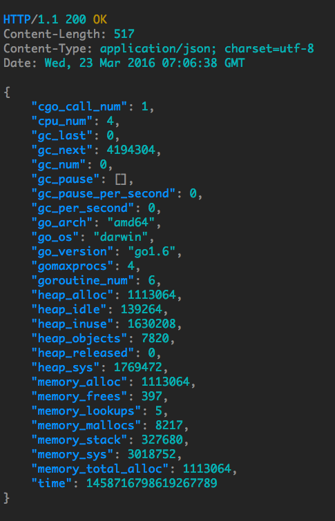

# gin-status-api

Golang cpu, memory, gc, etc information api handler written in Go (Golang) for [Gin](https://github.com/gin-gonic/gin) framework

[](https://godoc.org/github.com/appleboy/gin-status-api)
[](https://github.com/appleboy/gin-status-api/actions/workflows/go.yml)
[](https://github.com/appleboy/gin-status-api/actions/workflows/trivy-scan.yml)
[](https://goreportcard.com/report/github.com/appleboy/gin-status-api)
[](https://codecov.io/gh/appleboy/gin-status-api)

## Usage

Downladn this package.

```bash
go get github.com/appleboy/gin-status-api
```

To import this package, add the following line to your code:

```go
import "github.com/appleboy/gin-status-api"
```

## Example

Please see [example](example/server.go).

## Response

Please read [detail information](https://github.com/fukata/golang-stats-api-handler#toc3).


